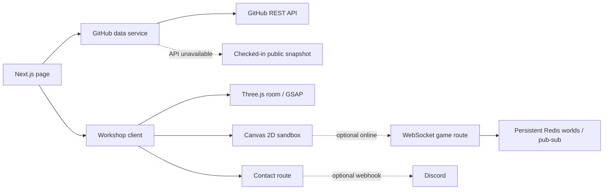

<div align="center">

# Psymariux's workshop

My projects and GitHub activity in a Minecraft workshop.

[Repository](https://github.com/psymariux/psy-portfolio) · [GitHub profile](https://github.com/psymariux) · [PsyStream](https://stream.psymariux.dev)

</div>

<p align="center">
  
</p>

<p align="center"><sub>The room is the navigation: approach a workstation to open the real project, activity or contact panel.</sub></p>

## Exploring the portfolio

Select a workstation to open a project, inspect recent work or send me a message. The character walks to it and interacts with the object. A labeled shelf provides the same controls for keyboard and phone users. Ctrl/Cmd+K searches destinations and the public repositories already on the page.

The GitHub data comes from [@psymariux](https://github.com/psymariux).

### Inside the room

- A Three.js scene built from locally resolved Minecraft Java 1.21.4 models, with the verified PsyMariux skin, a working redstone lever and a hinged chest.
- Real public GitHub projects, repository details and recent activity; an explicit fork disclosure keeps upstream work separate from my own.
- [PsyStream](https://stream.psymariux.dev), my closed-source streaming project, has a separate section.
- An optional, saveable shinobi sandbox hidden behind sleep, wake, then sleep again. Its authored village opens onto seeded, procedurally generated terrain, with quests, crafting, combat, farming and building.

<sub>The screenshot uses Minecraft game artwork and a personal skin. Their owners retain their rights; the repository’s AGPL-3.0 license does not relicense those assets. See the image and asset provenance.</sub>

## Room interactions

The character follows obstacle-aware routes from its current position. At the redstone lever, it reaches for the handle, grips it, flips the switch and releases it. The switch state persists when the panel closes. If WebGL cannot start, a captured room preview and the labeled object shelf remain available.

The optional game is a separate, full-screen Canvas experience. It starts with a fixed authored village, then streams deterministic terrain in all directions. Generated chunks are cached within a bound; player-made changes and discoveries are saved. Single-player progress stays in the browser, with validated import/export. Optional private online worlds keep shared terrain and individual inventories in Redis. WASD/arrows move, Shift sprints, Space jumps two clear tiles, and E/I opens inventory. Number keys or the mouse wheel select one of nine hotbar tools; primary click uses it and secondary click interacts or builds. Escape opens a pause menu with controls, sound and save/return. Movement, jump, held sprint, tools and menus also have touch controls.

Trail pavers and kiln bricks can be crafted, placed and recovered. Three frontier missions reward exploration, construction and resource gathering/combat; each reward can be claimed once. Existing saves retain their progress. Single-player simulation and visual animations stop during menus, and losing focus pauses without automatically resuming. Inventory uses Minecraft-style recessed slots, local vanilla item art, quantities in stacks of up to 64, crafting ingredients/output and a nine-slot item hotbar. Extra stacks have inventory pages rather than being discarded.

## Playing with friends

Open Inventory → Online, or Play with friends in the pause menu. The creator chooses survival or creative; creative grants unlimited building materials. Invite links open the shared-world lobby without requiring the sleep ritual. Up to eight players, including the creator, share terrain, buildings, crops and enemies while keeping individual inventories and progression. Menus stop only your controls, not the shared world.

The server validates actions and stores changes before publishing them. Redis compare-and-swap prevents concurrent players from duplicating resources or overwriting each other's builds. One leased world clock runs across instances. Connections automatically rejoin with the same player credentials after interruption or Vercel's function deadline; they do not resume held movement. Ordinary disconnects free a seat immediately; dropped connections have a 45-second presence grace period.

World records have no application expiry and survive everyone leaving or a server restart. Durability still depends on the Redis provider's persistence, eviction policy and backups. This is invitation-based play, not Minecraft/Mojang account authentication. This browser remembers up to 12 player credentials; clearing browser storage loses that identity. Invite links grant entry to anyone who has them, so share them only with friends. Worlds retain at most 64 saved player identities and have explicit terrain/storage limits: ±2048 player coordinates, 16,000 terrain edits, 4,096 explored chunks and a 2 MB room record. Export includes shared terrain plus your inventory as a local-world backup, not every player's credentials/inventory. A client import cannot overwrite an online room.

### Enable online play on Vercel

Online is unavailable until a database is connected; offline play remains usable. No database or paid subscription is provisioned by this repository.

1. In Vercel Marketplace, choose a Redis service supporting TCP/TLS connections, Lua `EVAL` and Redis pub/sub. A REST-only token is insufficient for this adapter. Check the service's price and usage limits before activating it.
2. Connect it to the portfolio project and set the server-only `REDIS_URL` environment variable to its Redis connection URI. Configure each desired Preview/Production environment separately; do not put credentials in Git or chat.
3. Choose persistence, no eviction of world keys, and a backup policy suitable for your worlds. Keep Redis close to the Vercel function region.
4. Redeploy. `vercel.json` enables Fluid Compute; `/api/game` uses Vercel's beta WebSocket upgrade API with a 300-second function duration. Test a create/join/reconnect cycle on the actual deployment.

See [Vercel WebSockets](https://vercel.com/docs/functions/websockets) and [Fluid configuration](https://vercel.com/docs/project-configuration/vercel-json#fluid). WebSockets use normal Vercel compute/data-transfer usage, and active rooms generate Redis commands. Free plans are not a guarantee of unlimited play; monitor quotas and set spending controls before widening access. Admission, creation, payload, action-rate and queue limits provide basic abuse resistance, not a substitute for deployment-level protection.

### Local online development

Use a disposable local Redis instance, then put these values in `.env.local`:

```dotenv
REDIS_URL=redis://127.0.0.1:6381
NEXT_PUBLIC_GAME_DEV_WS_URL=ws://127.0.0.1:3102/api/game
GAME_DEV_ORIGIN=http://localhost:3000
```

Run `npm run dev` and `npm run game:dev` in separate terminals. The local adapter binds to loopback and checks the browser origin; change `GAME_DEV_ORIGIN` if your Next.js URL differs. Production ignores the local endpoint override. To run the two-instance/eight-player integration check against that disposable database:

```sh
TEST_REDIS_URL=redis://127.0.0.1:6381 npm run test:online
```

The check creates its own world, verifies concurrent crafting/builds and restarts both socket servers, then removes that world's keys. It refuses non-local database URLs.

## Jukebox

A lower-right jukebox tab opens a timber-framed pixel side panel, also reachable from the vanilla jukebox in the room or quick navigation. It is separate from the object shelf and page rows. Tap the displayed disc to play; tap again to pause. Choose C418’s Sweden or Moog City, or let them alternate at the end of each track. The disc slides into both the side player and room block; pause leaves it inserted, while Eject disc stops playback, unloads the recording and lifts it out. A native slider beside the block adjusts volume from 0–100% in 5% steps (20% initially). Closing the panel keeps the music playing; Escape closes and returns focus to its tab.

Interaction sound effects unlock on the first real click/touch or keyboard gesture and can still be muted in the header. Music stays off until you tap the disc. Local MP3s load only on demand, without an iframe or external player. Hiding the tab or entering the dream pauses playback without automatically restarting it. Track sources, hashes and rights caveats are recorded in `public/audio/`; the project’s code license does not cover these recordings and their redistribution license has not been independently verified.

## Architecture

The page is server-rendered around a client-side workshop. Public GitHub data is normalized on the server; interactive scenes load only where they are used. The portfolio view, 3D room and sandbox share one experience without sharing a simulation loop.



### Behavior and boundaries

- One route planner handles character movement. The eight-object shelf provides keyboard and touch controls; the jukebox has a separate side control. Reduced motion skips travel and transitions.
- The server paginates public repositories owned by `psymariux` and recognizes personal commits under both that login and the former `nohint404` author name. `GITHUB_TOKEN` stays server-side. An anonymous visibility check excludes repositories that became private during collection.
- `lib/ninja-game.ts` owns simulation and save validation, `lib/ninja-world.ts` generates terrain, and `lib/ninja-render.ts` draws it. A bounded chunk cache holds generated terrain; versioned browser saves store local player changes. `lib/ninja-online.ts` runs authoritative shared-world actions; `lib/ninja-room-store.ts` stores atomic revisions; `lib/ninja-socket.ts` coordinates sockets and the leased clock.
- The contact route checks origin, validates input and limits requests in-process. Without `DISCORD_WEBHOOK_URL`, it reports that delivery is unavailable.
- Minecraft artwork, the personal skin, PsyStream branding and audio retain their owners' rights and provenance. AGPL-3.0 covers the project's licensed code.

## How it is built

- Next.js 16 App Router, React 19 and TypeScript render the portfolio and its server-side data routes.
- Three.js draws the walkable workshop; GSAP coordinates character, camera and object interactions.
- The hidden game uses Canvas 2D, keeping world simulation, deterministic terrain and rendering in separate modules.
- Radix Dialog handles accessible panels and the game shell. Tailwind CSS 4 and local CSS provide the pixel-workshop styling.
- GitHub data is fetched server-side, normalized before display and cached for 30 minutes. A checked-in public snapshot is the outage/rate-limit fallback; no private repository data is exposed.

### Application source map

| Path | What lives there |
| --- | --- |
| `app/` | Next.js page, layout and `/api/github`, `/api/contact`, `/api/game` routes |
| `components/Workshop.tsx`, `components/Scene.tsx` | Portfolio experience and 3D room |
| `components/NinjaDream.tsx` | Hidden sandbox interface and Canvas lifecycle |
| `components/MinecraftInventory.tsx`, `components/NinjaOnlinePanel.tsx` | Minecraft inventory/crafting and private-world lobby |
| `lib/ninja-online*.ts`, `lib/ninja-room-store.ts`, `lib/ninja-socket.ts` | Online protocol, client reconnect, authoritative room state and persistence |
| `components/Jukebox.tsx` · `lib/jukebox.ts` | Opt-in local music controls and the two-record playlist |
| `lib/ninja-world.ts`, `lib/ninja-game.ts`, `lib/ninja-render.ts` | Terrain generation, simulation/save validation, and drawing |
| `lib/github-core.ts`, `lib/github.ts` | Public GitHub normalization and server-side cached fetch |
| `config/portfolio.ts` | Explicitly featured public repositories |
| `public/minecraft/`, `public/art/` | Bundled visuals and per-asset provenance |
| `tests/` | Game, data-boundary, interaction and asset checks |

## Local development

The application uses Node.js 22.18+ and npm (`package-lock.json`). Clone this repository, then run:

```sh
git clone https://github.com/psymariux/psy-portfolio.git
cd psy-portfolio
npm ci
cp .env.example .env.local
npm run dev
```

Open [http://localhost:3000](http://localhost:3000). The checked-in GitHub snapshot makes the page usable without API credentials. `GITHUB_TOKEN` is optional and server-only; do not use a `NEXT_PUBLIC_` token. `DISCORD_WEBHOOK_URL` is optional and enables message delivery; without it, the form reports that delivery is unavailable. `NEXT_PUBLIC_SITE_URL` sets the canonical and Open Graph origin.

Useful checks and maintenance commands:

```sh
npm test
npm run lint        # ESLint and TypeScript
npm run build
npm start           # serve the production build
npm run github:snapshot
```

`vercel.json` configures the Next.js build and Fluid Compute. `REDIS_URL` is optional and server-only; without it, `/api/game` returns an unavailable response and the local sandbox still works. The live PsyStream project is linked above; this repository is the portfolio source.

## License and image credits

[`LICENSE`](LICENSE) applies GNU AGPL-3.0 to the repository’s covered code. It does not relicense Minecraft artwork, the personal skin, PsyStream branding, or third-party audio. Those retain their respective owners’ rights. Provenance for the included screenshot is in [`docs/readme/workshop.webp.provenance.json`](docs/readme/workshop.webp.provenance.json). Asset sources and provenance are recorded beside files under `public/`; those third-party works remain outside the AGPL code license.
